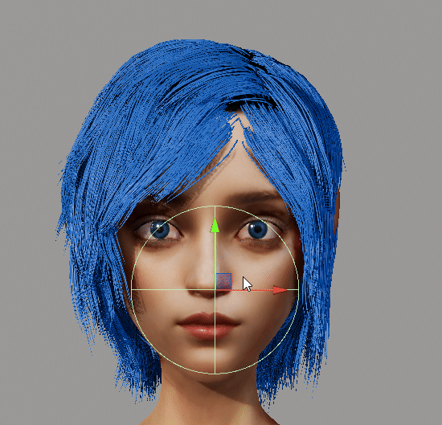

```c
TODO metadata
TODO mention git repo, and what is in it
TODO repo: readme, license, cleanup blender+unity
TODO all links
```


In this article we will create hair in Unity using their [com.unity.demoteam.hair](https://github.com/Unity-Technologies/com.unity.demoteam.hair) package (based on [AMD's TressFX](https://gpuopen.com/tressfx/)). As a lot of people noticed, the [official documentation](https://learn.unity.com/project/getting-started-with-hair-simulation) is.. lacking. There was SIGGRAPH 2022 presentation ["Probe-based lighting, strand-based hair system, and physical hair shading in Unity’s ‘Enemies’ "](https://advances.realtimerendering.com/s2022/index.html#Enemies) (hair-related part starts at slide 58), but it's mostly a list of used technology. Even the unlisted(!) video ["Inside Unity’s new flagship demo, Enemies | Unity at GDC 2022"](https://youtu.be/tz3dpl7FlH4?si=nFLm1QcMe21-uBuk&t=1126) from the official Unity's YouTube channel just walks through the sample scene. None of these help the artist in actually creating a new hair for their character. Let's remedy that.

> There also exist [cn.unity.hairfx.core](https://github.com/Unity-China/cn.unity.hairfx.core). It's a simple [port](https://github.com/Unity-China/cn.unity.hairfx.core/blob/main/Runtime/TressFXFileFormat.cs#L35) of TressFX. As we will see, `com.unity.demoteam.hair` is only loosely inspired by AMD's work.

We will start with a hair system in Blender, and export it into Alembic curves. The file gets imported into Unity, where we add materials and tweak physics settings. We then add collisions using both capsules and signed distance fields (SDF).


> I do not work for Unity. I do not even work in this tech sector. I've tried integrating hair into ["AI-Iris-Avatar"](https://github.com/Scthe/ai-iris-avatar) and I quickly gave up. I do have a [previous](https://github.com/Scthe/WebFX) [experience](https://github.com/Scthe/Rust-Vulkan-TressFX) with [TressFX](https://github.com/Scthe/TressFX-OpenGL).


## Creating hair in Blender

At first, I recommend to grow the hair on a simple plane. Later on, you would want to isolate the haircap mesh and style the hair. Often, many hair systems are combined to create single hairstyle. Separate one for fringe, bangs, scalp, nape, ponytail, bun, etc. But once you understand the main process it will be easier to adjust.

> You might notice I'm using Blender's old, [deprecated](https://docs.blender.org/manual/en/latest/physics/particles/hair/index.html) hair system. Year ago, in [Blender 3.5](https://www.blender.org/download/releases/3-5/), the procedural/curve based system become the default. On the other hand, some people reading this article might have never used Blender before. The old system, while less powerful, is a bit easier to grasp.

1. Create a plane: `Shift + a` -> `Mesh` -> `Plane`.
2. In "Properties" switch to "Particles" tab. Add a new Particle system with type "Hair".
3. Change strand number and hair length.
    1. If the hair looks "blocky", increase "Viewport display" -> "Strand Steps". Also, in scene render settings, set "Curves" -> "Shape" to "Strip" with 3 subdivisions.
    2. You can add children to spawn more strands based on current ones. If your system has 100 strands, and children's "Render Amount" is 100, you will export 10000 hair strands total.
4. In viewport, switch to "Particle Edit" mode.
5. Use the tools to comb the hair.
6. (Optional) UV unwrap the mesh.
    1. Switch to "Edit mode".
    2. Press `u` and select unwrap.

> Be carful where the object origin is. The hair is usually ~1.80m from the ground, but it's better if the origin is around the center of the mesh. It makes it easier to add "Parent Constraint" in Unity later.

<Figure>
  <BlogImage
    src="./blender-create-hair.jpg"
    alt="Blender during editing particle-based hair system."
  />
  <Figcaption>

  Editing hair in Blender using the older, particle-based system. Numbers correspond to the steps from the instructions above.

  </Figcaption>
</Figure>


If you are using the **new Blender hair system** (based on curves) there are a few additional steps before the export. First, apply the **curve object's** modifiers. This is a curve-specific set of modifiers, separate from the base mesh. The new hair solution is aimed at non-destructive editing. The curly hair is achieved by applying curl node/modifier procedurally to a straight hair strand. Skipping this step would export the unmodified strand. You might want to backup the curve object before squashing the modifier stack. Then, convert the **curve object** into a particle system: "Object" -> "Convert To" -> "Particle System". This operation is non-destructive - it copies the data. Hide the original curve object to preview the particle-based hair. There is a video tutorial on YouTube that I have used as a guide: ["Alembic Hair from Blender to Unity Tutorial [ Pt 1 ]"](https://www.youtube.com/watch?v=l-XK6pNjC1Q) by Ciorbyn Studio. As a test, I've imported Blender's [official sample file](https://www.blender.org/download/releases/3-5/) into Blender 4.0 and [exported it into Unity](https://github.com/Scthe/unity-hair). It worked out fine.

Once the hairstyle is complete, we can export it to Unity.

1. Make sure the object with the hair system is selected.
2. "File" -> "Export" -> "Alembic (.abc)".
3. In export settings, check "Only selected objects".
4. Make sure "Frame Start" and end are different numbers (it's common crash cause in Unity). If they are the default 1 and 250 it's perfect. It **may** work, but better safe than sorry. The actual numbers here do not matter, they just crash the Unity editor if something is wrong.
5. Export to the file inside the unity project's "Assets" directory.


<Figure>
  <BlogImage
    src="./blender-export-settings.jpg"
    alt="Blender export settings for Alembic file that contains hair's curves."
  />
  <Figcaption>

  Blender export settings for Alembic file that contains hair's curves.

  </Figcaption>
</Figure>


Make sure your object **does not have any modifiers other than the particle system**. Especially mirror or subdivision. Apply them before exporting. Check the ".abc" file size. If it's &lt; 20kb something probably went wrong. Google "Alembic file viewer online" and try your file there. The base mesh should be visible (but no hair). It's a quick sanity check.

You do not need to rig the human hair. We will parent it to Unity mecanim's "Head" bone. I'm not sure how this would work if you actually needed skinning. That's a problem for characters with a beard, as the jaw moves independently from the sideburns. You could have a separate "Jaw" bone that is animated during lip sync. One hair system is parented to it, while the sideburns follow the "Head" bone. Since the natural jaw movement is limited and hair is transparent, this layering **could** work. You can also check [com.unity.demoteam.digital-human](https://github.com/Unity-Technologies/com.unity.demoteam.digital-human) for a better solution that allows the hair to be influenced by underlying geometry.


## Importing hair into Unity

### Required Unity extensions

We will need following Unity extensions:

* `com.unity.demoteam.hair`
    * Installed using git link: `https://github.com/Unity-Technologies/com.unity.demoteam.hair.git`.
    * Documentation: [https://learn.unity.com/project/getting-started-with-hair-simulation](https://learn.unity.com/project/getting-started-with-hair-simulation).
    * Git repo: [https://github.com/Unity-Technologies/com.unity.demoteam.hair](https://github.com/Unity-Technologies/com.unity.demoteam.hair).
* `com.unity.formats.alembic`
    * Present in Unity Registry by default. You just need to activate it.
* `com.unity.demoteam.mesh-to-sdf` (only needed for SDF collisions)
    * Installed using git link: `https://github.com/Unity-Technologies/com.unity.demoteam.mesh-to-sdf.git`.
    * Documentation: [https://github.com/Unity-Technologies/com.unity.demoteam.mesh-to-sdf/blob/main/Documentation~/index.md](https://github.com/Unity-Technologies/com.unity.demoteam.mesh-to-sdf/blob/main/Documentation~/index.md).
    * Git repo: [https://github.com/Unity-Technologies/com.unity.demoteam.mesh-to-sdf](https://github.com/Unity-Technologies/com.unity.demoteam.mesh-to-sdf).

Install them all using Unity's Package Manager ("Window" -> "Package Manager").

> It's possible that Unity will crash during installation of the Alembic extension. It means that it was installed correctly, but it tried to read an invalid ".abc" file. This extension has no error handling whatsoever. If the file is incorrect, the whole editor will crash.


### Creating hair asset

If the Alembic file is OK, Unity will automatically read it (the whole editor will crash otherwise!). Select it in the "Project" window to bring out "Inspector" settings. Make sure "Import Curves" is ON, while "Add Curve Renderers" is OFF (see picture). The "Scale Factor" should be reverse of what you provided during Blender export.  At the bottom of the inspector is the preview. It will only show the mesh and not the hair. This is OK.

<Figure>
  <BlogImage
    src="./unity-alembic-file.jpg"
    alt="Alembic file import settings inside Unity."
  />
  <Figcaption>

  Alembic file import settings inside Unity.

  </Figcaption>
</Figure>


Go back to the "Project" window and: Right click anywhere -> "Create" -> "Hair". In "Type" select "Alembic". There should be a new UI group below called "Settings Alembic". In "Alembic Asset" select the ".abc" file (may take a minute to show up). Scroll down to find the "Build strand groups" button, which will make the preview appear. If the asset was exported incorrectly, you will get a warning like "No curves found".

<Figure>
  <BlogImage
    src="./unity-asset-settings.jpg"
    alt="Hair asset settings."
  />
  <Figcaption>

  Hair asset settings.

  </Figcaption>
</Figure>

"Build strand groups" button regenerates the hair strands. You have to click it every time you make a change in asset settings or reimport the ".abc" file from Blender.

> It's also possible to generate hair without using Alembic file. E.g. emit a hair strand from every mesh triangle etc.


### Hair asset settings

There are a few settings you can adjust when creating the hair asset.

In "Settings Basic", [Memory layout](https://github.com/Unity-Technologies/com.unity.demoteam.hair/blob/7fe8b81797b013a51f42dc1f9062892bfd529c7b/Runtime/HairAsset.cs#L328) describes how points all stored in GPU memory. **Sequential** means that all points for strand N are store right after another. Then all points for strand N+1, etc. **Interleaved** means that all first points for all strands are stored first. Then every 2nd point from all strands. Repeat for all points. Which one is more performant depends on how compute shader accesses the data. I recommend to check if there is any FPS change.

In "Settings Alembic", **Resample Curves** is strongly recommended. The asset you have exported probably has different distances between each point of each strand. For example, from strand's root to 2nd point is 4cm, while from 2nd to 3rd is 2cm. It's even possible that not all curves have same number of points. **Resample resolution** dictates the number of points in each strand. Each point will be spaced evenly. It's recommended that this number is a power or multiply of 2. The more points, the more smooth and computationally expensive the hair is. **Resample quality** is an implementation detail of the resample algorithm. Due to curvature of each strand, it's impossible to predict what is the best distance between each point. The last segment will always be a bit shorter/longer. To solve this, the algorithm is run in a few iterations. I doubt you will notice a difference if you change it from the default 3.

Resample resolution depends on many factors. Short, straight hair does not require many points. Wavy, shoulder-length is a bit more complex. Heavy curls? Forget. While buns have tight shape, they are quite small. I'd say a few "runaway" strands even add to the appeal. For long braids, I would consider entirely separate mesh that grows new hair along it's length. Even for simpler hairstyles it's common to create separate assets instead of one-size-fits-all.  E.g. a common details in buns are short hairs around the nape, which do not require much resolution. Another example is a hime cut, where you can clearly separate fringe and both sidelocks into 3 distinct parts.


**UV resolve** options are used when sampling textures. Imagine some hair strands in the same hair system are red and some are blue. It's possible that the UV for each strand is encoded in a strand itself, or from the Blender base mesh we grew the hair from. If you have unwrapped the mesh in Blender, set "Root UV" to "Resolve From Mesh" and in "Root UV Mesh" pick the mesh from the ".abc" file.

**Proportions** allow you to assign the width of each strand. With Blender, this is not exported. Use the "fallback" controls instead. The **Tip Scale** option allows you make the tip of each strand thinner than the root. Examples:

* Set **Strand Diameter Fallback** = 1 and **Tip Scale Fallback** = 1 to have rectangular strips.
* Set **Strand Diameter Fallback** = 1, **Tip Scale Fallback** = 0, and  **Tip Scale Fallback Offset** = 0, to have triangular strips.

**LOD settings** control level of detail when viewing the hair from different distances. No need for 100000 strands when the object is far away. Exact values depend on your use case. Use **Base LOD Cluster Quantity** to control how many LOD levels to create. In the Inspector's preview window (scroll down) you can see each LOD and check the strand count (expand "Lod Guide Count"). I'm not sure if using hair cards for LOD would not be a generally better idea.

Do not forget to click the **"Build strand groups" button** after each change. The "Memory layout" and "Resample" options might clue you that the hair asset reshapes the curves from the Alembic file into a more Unity-friendly representation. From now on, you will only operate on this format.

### Creating hair instance

Time to create an empty Game Object and assign **Hair Instance (Script)** component to it. In **System Contents** assign the hair asset. This will make hair appear in the viewport.


<Figure>
  <BlogImage
    src="./unity-default-hair.jpg"
    alt="Screenshot from Unity with the hair object settings."
  />
  <Figcaption>

  Sintel's original hairstyle as imported into Unity. This is the default hair shader that visualizes hair clumps. Required steps marked with red arrows. The big blue "Settings" box are all options used to configure hair rendering and physics. Do not miss **the yellow arrow** next to the strand group. It expands additional adjustments for subset of the hair strands.

  </Figcaption>
</Figure>


Scaling the game object might work differently than expected. It does not affect hair length, just increases distances between hair roots. Instead, go back to Alembic file's "Inspector" and adjust "Scale Factor". Then click "Build strand groups" in hair asset to resample strands after change. Alternatively, your new object also has "Strand Length" under "Settings Geometry". It's right next to "Strand Diameter".

If the hair does not look OK, it's either because of the scale (see above) or because it's already affected by gravity. In the hair instance component, go to "Volume Settings" -> "Settings Environment" and set "Gravity Scale" to 0.


## Hair instance settings

In this section we will discuss settings that affect all strand groups added to the game object. The "Strand Settings" allows you to configure subset of strands. I will describe it in the <CrossPostLink paragraph="Hair instance - strand group settings">"Hair instance - strand group settings"</CrossPostLink>.


### Settings Executive

**Settings Executive** contains settings related to simulation timesteps. You can choose to simulate hair e.g. 30 times per second. Due to how Unity works, it will [accumulate time](https://github.com/Unity-Technologies/com.unity.demoteam.hair/blob/7fe8b81797b013a51f42dc1f9062892bfd529c7b/Runtime/HairInstance.cs#L677) since the last update. Then it retroactively checks how many updates it missed. If last hair update was 80ms ago and update is at 30Hz (every ~33.3 ms), it will [simulate hair 2 times](https://github.com/Unity-Technologies/com.unity.demoteam.hair/blob/7fe8b81797b013a51f42dc1f9062892bfd529c7b/Runtime/HairInstance.cs#L758) in a row. Use **Update Steps Min** and **Update Steps Max** to control this. Later on you will learn about "Solver Substeps", which split each simulation into smaller steps.

### Settings Environment

**Settings Environment** describe gravity, wind and colliders. Gravity should be self-explanatory. We will look at wind and colliders later.

### Settings Volumetrics

> I'm not going to explain this in much detail, as I'm not exactly sure about this part. You will get my best guess. The [HairSimComputeVolume.compute](https://github.com/Unity-Technologies/com.unity.demoteam.hair/blob/7fe8b81797b013a51f42dc1f9062892bfd529c7b/Runtime/HairSimComputeVolume.compute) is 1600 lines long. And that's physics simulation, not some mundane React components.

In hair systems some properites are [accumulated over grid](https://www.youtube.com/watch?v=ool2E8SQPGU) (watch the chapter about the friction) to make it easier/faster to compute. For Unity, [looking at the code](https://github.com/Unity-Technologies/com.unity.demoteam.hair/blob/7fe8b81797b013a51f42dc1f9062892bfd529c7b/Runtime/HairSim.cs#L309), this seems to be:

* Weight.
* Velocity.
* Density.
* [Divergence](https://github.com/Unity-Technologies/com.unity.demoteam.hair/blob/7fe8b81797b013a51f42dc1f9062892bfd529c7b/Runtime/HairSimComputeVolume.compute#L570).
* [Pressure](https://github.com/Unity-Technologies/com.unity.demoteam.hair/blob/7fe8b81797b013a51f42dc1f9062892bfd529c7b/Runtime/HairSimComputeVolume.compute#L685). Comment in code points to [GPU Gems: Chapter 38. Fast Fluid Dynamics Simulation on the GPU](https://developer.nvidia.com/gpugems/gpugems/part-vi-beyond-triangles/chapter-38-fast-fluid-dynamics-simulation-gpu).
* [Pressure gradient](https://github.com/Unity-Technologies/com.unity.demoteam.hair/blob/7fe8b81797b013a51f42dc1f9062892bfd529c7b/Runtime/HairSimComputeVolume.compute#L861).
* [Scattering](https://github.com/Unity-Technologies/com.unity.demoteam.hair/blob/7fe8b81797b013a51f42dc1f9062892bfd529c7b/Runtime/HairSimComputeVolume.compute#L943).
* [Impulse](https://github.com/Unity-Technologies/com.unity.demoteam.hair/blob/7fe8b81797b013a51f42dc1f9062892bfd529c7b/Runtime/HairSimComputeVolume.compute#L1010).

## Hair instance - strand group settings

Let's go back to "Strand Settings". Each "Hair Instance" component allows you to link many hair assets. Some settings can be adjusted for each asset individually. Next to each group there is a sneaky **edit button** that will allow you to e.g. assign different material to assets in this group. At least 1 strand settings are required to act as defaults.

<Figure>
  <BlogImage
    src="./unity-strand-settings.jpg"
    alt="Unity hair strand settings. Subsections for skinning, geometry, rendering, and physics."
  />
  <Figcaption>

  Unity hair group settings. That's a lot of options! None of this has even a word in offical Unity's documentation.

  </Figcaption>
</Figure>


### Settings Skinning

**Settings Skinning** require [com.unity.demoteam.digital-human](https://github.com/Unity-Technologies/com.unity.demoteam.digital-human) package. I highly doubt you will ever use it. While it allows e.g. skin wrinkling, it was, well.. not created to be reusable. There are scenarios where this functionality would be useful. E.g. since all humans have fuzz hair all over the body, wrinkles might affect roots. Or when underlying geometry is affected by multiple skeleton bones.

### Settings Geometry

**Settings Geometry** allows to override both strand length and diameter. Switching diameter does not work with all strand renderers (e.g. lines). **Strand Separation** allows you to spread the hair tips from each other.

**Bounds** leave to automatic. In current `com.unity.demoteam.hair` version, the widget seems to be broken.

**Staging** refers to compression of position data between physics simulation and renderer. "Full" [stores data](https://github.com/Unity-Technologies/com.unity.demoteam.hair/blob/7fe8b81797b013a51f42dc1f9062892bfd529c7b/Runtime/HairSim.cs#L1091) as Vector3, while "Half" uses Vector2. At the end of the physics simulation there is a staging compute shader that [writes this data](https://github.com/Unity-Technologies/com.unity.demoteam.hair/blob/7fe8b81797b013a51f42dc1f9062892bfd529c7b/Runtime/HairSimComputeSolver.compute#L2124). The only code path that calls [_StagingVertex.LoadX()](https://github.com/Unity-Technologies/com.unity.demoteam.hair/blob/7fe8b81797b013a51f42dc1f9062892bfd529c7b/Runtime/HairSimData.hlsl#L209) is from the [renderer](https://github.com/Unity-Technologies/com.unity.demoteam.hair/blob/7fe8b81797b013a51f42dc1f9062892bfd529c7b/Runtime/HairVertex.hlsl#L223).


### Settings Rendering

Finally! You can override the hair color. Use [HairMaterialdefaultLitSRP](https://github.com/Unity-Technologies/com.unity.demoteam.hair/blob/7fe8b81797b013a51f42dc1f9062892bfd529c7b/Runtime/HairMaterialDefaultLitSRP.shadergraph) (it should be already accessible through `com.unity.demoteam.hair` package) as a base. Hair uses special shader. You need to add `HairVertex` node and connect it's properties to the Vertex's position, normal, tangent, velocity. As well as Fragment's normal (tangent space). See <CrossPostLink paragraph="Adding materials">"Adding materials"</CrossPostLink> section below for full explanation.


Each strand is a collection of points connected by [lines](https://www.youtube.com/watch?v=_LtQJHmW-lc).  In math, line does not have width. So how do you render the strand? In Unity this is determined by **Renderer**:

* **None**. Does not render hair.
* **Buildin Lines**.  When you draw a triangle everyone assumes it's gonna be "filled" (rasterized). But why not just draw only the edges, if this is the effect you want? Think how many times you overlayed wireframes on top of the objects. In this mode you do not explicitly deal with triangles. Just remember, these lines will be thin (not adjustable). Some graphic APIs even have this feature build in (`GL_LINES` in OpenGL).
* [Buildin Strips](https://github.com/Unity-Technologies/com.unity.demoteam.hair/blob/7fe8b81797b013a51f42dc1f9062892bfd529c7b/Runtime/HairInstanceBuilder.cs#L421). This is the mode you want. Each point is expanded into 2 vertices. Four vertices between 2 consequtive points create a quad. The vertex positions are calculated based on the direction vector between both points (AKA tangent) and direction to the camera. Each vertex is moved `hairWidth/2` away from the point that created it (see image below). In some distant way this is similar to [billboards](https://docs.unity3d.com/Manual/class-BillboardRenderer.html). This approach may produce long, thin triangles, which can be a problem for the GPU. Nevertheless, this is the setting that you will **always** use.
* [Buildin Tubes](https://github.com/Unity-Technologies/com.unity.demoteam.hair/blob/7fe8b81797b013a51f42dc1f9062892bfd529c7b/Runtime/HairInstanceBuilder.cs#L471). Seems to be similar to strips, but instead of a single flat plane it renders all 4 sides of each segment (front, back, both sides). Check the [original PR](https://github.com/Unity-Technologies/com.unity.demoteam.hair/pull/47/files) and the "drawing" in the code docs.


<Figure>
  <BlogImage
    src="./unity-hair-mesh-strips.png"
    alt="Vectors that create mesh in strips renderer mode."
  />
  <Figcaption>

  **Tangent** - vector toward next point (unless it's a tip/last point). **Bitangent** - vector that has right angle to both tangent and vector-towards-camera. Each mesh's vertex is created by moving half of the hair radius along bitangent (either in positive or negative direction). Alternative way to visualize is to imagine plane created from tangent and "to camera" vectors. Bitangent is the normal vector of this plane.

  </Figcaption>
</Figure>


Each of the techniques works better with anti-aliasing.

As with all Unity render settings, you can adjust layers. There is also an option for hair self-shadowing (**Renderer Shadows**) and LOD selection.

**Clip Threshold** is used to [discard pixels](https://github.com/Unity-Technologies/com.unity.demoteam.hair/blob/7fe8b81797b013a51f42dc1f9062892bfd529c7b/Runtime/HairVertex.hlsl#L264) below coverage threshold. The [calculation](https://github.com/Unity-Technologies/com.unity.demoteam.hair/blob/7fe8b81797b013a51f42dc1f9062892bfd529c7b/Runtime/HairSimComputeLOD.hlsl#L51) seems to depend solely on the distance from the camera. Closer fragments have bigger coverage.

> In TressFX there is a concept called pixel coverage (which is missing from Unity's implementation). Tiny hair strand may not cover whole pixel. Given how hair is rasterized, the pixel coverage is calculated manually in compute/fragment shader. E.g. if only 80% of the pixel is covered in hair, the alpha would be 0.8. As you might know, transparent object have to be rendered in specific order. And each of your thousand hair strands can be transparent. Given how hair is rendered, it forces using [Order-independent transparency (OIT)](https://en.wikipedia.org/wiki/Order-independent_transparency), usually implemented as Per-Pixel Linked Lists (PPLL). This is exactly how it worked in TressFX.


### Settings Physics

> Reverse engeneering physics is not fun. I've simplified the explanations where possible. There is a high chance I got something wrong anyway.

#### Solver

**Solver** refers to the method used to solve a system of linear equations. You can choose from [Gauss–Seidel](https://en.wikipedia.org/wiki/Gauss%E2%80%93Seidel_method) or [Jacobi](https://en.wikipedia.org/wiki/Jacobi_method) methods. Basically, a lot of constraints and collisions influence the final position. Fixing one may invalidate other. With subsequent iterations we get consequitevely less wrong results with respect to all considered constraints. I recommend to leave the default Gauss–Seidel as it should be fastest and accurate/stable enough.

You can adjust **Solver Substeps** per each update. E.g. instead of simulating the hair once per update and multiplying by `deltaTime`, simulate it 4 times in a row and multiply it by `deltaTime/4` each time. From [HairSim.cs](https://github.com/Unity-Technologies/com.unity.demoteam.hair/blob/7fe8b81797b013a51f42dc1f9062892bfd529c7b/Runtime/HairSim.cs#L860):

```c
solverConstants._DT = deltaTime / Mathf.Max(1, settingsPhysics.solverSubsteps);
solverConstants._Substeps = (uint)Mathf.Max(1, settingsPhysics.solverSubsteps);
```

Later on used to [drive the for-loop](https://github.com/Unity-Technologies/com.unity.demoteam.hair/blob/7fe8b81797b013a51f42dc1f9062892bfd529c7b/Runtime/HairSim.cs#L997).

Assume you have 3 substeps and update rate 30Hz (every ~33.3 ms). If last hair update was 80ms ago it will [update the hair 2 times](https://github.com/Unity-Technologies/com.unity.demoteam.hair/blob/7fe8b81797b013a51f42dc1f9062892bfd529c7b/Runtime/HairInstance.cs#L758). Each update will have 3 substeps (each using delta time ~11.1ms). In total, it does the simulation 6 times during this frame.

More substeps mean more work for the GPU, but more accurate results. This is particularly important for collision. I recommend to be conservative due to possible FPS hit.


[Constraint iterations](https://github.com/Unity-Technologies/com.unity.demoteam.hair/blob/7fe8b81797b013a51f42dc1f9062892bfd529c7b/Runtime/HairSimComputeSolver.compute#L1517). During the simulation, compute shader will repeat the calculations, each time getting better result. This is another multiplier on top of substeps and "Update Steps Max". This time, the for-loop is inside the compute shader. There are some small differences in the actual purpose of these settings, but they are quite subtle. I'm not 100% sure I got them correctly, so I will just inform you what performance impact can be expected.

[Constraint Stiffness](https://github.com/Unity-Technologies/com.unity.demoteam.hair/blob/7fe8b81797b013a51f42dc1f9062892bfd529c7b/Runtime/HairSimComputeSolver.compute#L179) determines how much the constraints affect the outcome. Each subseqent constraint iteration (see above) has lower stiffness. If there is only 1 iteration, this parameter has linear outcome. Setting this to 0 removes most of the constraints and the hair may go haywire. This can be useful for non-dynamic hair. Setting this to 1 will strongly enforce all constraints, which may lead to instability. I recommend to adjust this based on the stability of the system.

**Constraint SOR**. The tooltip says "successive over-relaxation factor". I'm not even going to [guess from code](https://github.com/Unity-Technologies/com.unity.demoteam.hair/blob/7fe8b81797b013a51f42dc1f9062892bfd529c7b/Runtime/HairSimComputeSolver.compute#L1805).

#### Forces

**Damping** limits the delta between simulation steps. Imagine a `lerp(position_previous, position_next, 1-damping)`.  This refers to a [global point position](https://github.com/Unity-Technologies/com.unity.demoteam.hair/blob/7fe8b81797b013a51f42dc1f9062892bfd529c7b/Runtime/HairSimComputeSolver.compute#L336) (expressed as position change AKA velocity), or [relative to the previous point](https://github.com/Unity-Technologies/com.unity.demoteam.hair/blob/7fe8b81797b013a51f42dc1f9062892bfd529c7b/Runtime/HairSimComputeSolver.compute#L344) on the curve. The code is a bit more complicated than that, but I think that's a good intuition. This should be your primary setting to adjust (along with constraint stiffness), if the system is not stable.

**Cell settings** are related to volume-based physics. See <CrossPostLink paragraph="Settings Volumetrics">"Settings Volumetrics"</CrossPostLink> above.

**Gravity** allows you to modify gravity force that was defined for the whole hair system. This acts as a multiplier.

#### Constraints

Constraints are a set of rules the hair should follow. E.g. each strand should have certain length and shape. Imagine that strong wind blows and the hair is suddenly 1m longer. The problem arises if the constraints conflict with each other. This is what makes the hair physics complicated.

No constraint or force can move root point of each strand. Only subsequent points are influenced. In code this is expressed as a multiplicative weight that is either 0 or 1. Only game object's transformation (e.g. rig or Unity's object hierarchy) affects the position of the strand's root. It will always stay on the scalp.

**Boundary Collision** allows to turn all collisions ON/OFF. This includes both Unity build-in colliders (e.g. "Capsule Collider" component) as well as SDF colliders.

[Distance constraint](https://github.com/Unity-Technologies/com.unity.demoteam.hair/blob/7fe8b81797b013a51f42dc1f9062892bfd529c7b/Runtime/HairSimComputeSolverConstraints.hlsl#L480) preserves initial distances (based on the original hair asset) between subsequent points. In code, stiffness seems to be hardcoded to 1.0. This means that each strand segment will never change it's length. No matter what forces you apply. Imagine hair that gets longer the stronger the wind blows! This constraint brings both points closer together (it cannot move the strand's root). I recommend double checking this is ON and never touching it again.

[Distance LRA constraint](https://github.com/Unity-Technologies/com.unity.demoteam.hair/blob/7fe8b81797b013a51f42dc1f9062892bfd529c7b/Runtime/HairSimComputeSolverConstraints.hlsl#L176). LRA stands for "Long Range Attachments". Introduced by [Kim12](https://www.researchgate.net/publication/235340926_Long_Range_Attachments_-_A_Method_to_Simulate_Inextensible_Clothing_in_Computer_Games). It calculates distance from strand's root to every subsequent point. Each point needs to be within this distance at any point in time. If it is further, it is reprojected back. From the original paper:

> For every unconstrained particle *i*, we pre-compute the initial distance $r_i$ from the particle to the attachment point. During the simulation, if the particle is within this distance, we allow it to freely move. If the particle moves beyond this limit, we project it back to the surface of a sphere centered at the attachment point with radius $r_i$.


<Figure>
  <BlogImage
    src="./unity-constraint-lra.png"
    alt="visualizaation of long range attachments algorithm."
  />
  <Figcaption>

  Original drawing from [Kim12].

  </Figcaption>
</Figure>


I recommend to have this constraint ON. From what I have heard, it might make the hair feel "bouncy", but it's a usueful addition to a "normal" distance constraint.


[Distance FTL constraint](https://github.com/Unity-Technologies/com.unity.demoteam.hair/blob/7fe8b81797b013a51f42dc1f9062892bfd529c7b/Runtime/HairSimComputeSolverConstraints.hlsl#L198). FTL stands for Follow-The-Leader. Introduced by "Fast Simulation of Inextensible Hair and Fur" ([Muler12](https://www.researchgate.net/publication/235259170_Fast_Simulation_of_Inextensible_Hair_and_Fur)). It's same as the distance constraint discussed above, but moves only latter point. It has adjustable correction. I recommend checking if (given other length constraints) you really need this.

[Local Curvature constraint](https://github.com/Unity-Technologies/com.unity.demoteam.hair/blob/7fe8b81797b013a51f42dc1f9062892bfd529c7b/Runtime/HairSimComputeSolverConstraints.hlsl#L522) based on "A Triangle Bending Constraint Model for Position-Based Dynamics" ([Kelager10](https://www.researchgate.net/publication/221622667_A_Triangle_Bending_Constraint_Model_for_Position-Based_Dynamics)). This paper has more complicated geometric representation. Yet the main idea is simple. From 3 subsequent points (P1, P2, P3) create a triangle. Calculate distance from the average point `(P1.xyz + P2.xyz + P3.xyz) / 3` to the middle point P2. Apply correction to the position of P1, P2, P3 based on the change wrt. initial distance. More expensive calculations can use median intersection. I recommend leaving the default value - OFF.

[Local shape constraint](https://github.com/Unity-Technologies/com.unity.demoteam.hair/blob/7fe8b81797b013a51f42dc1f9062892bfd529c7b/Runtime/HairSimComputeSolverConstraints.hlsl#L356)  (and [SolveMaterialFrameBendTwistConstraint()](https://github.com/Unity-Technologies/com.unity.demoteam.hair/blob/7fe8b81797b013a51f42dc1f9062892bfd529c7b/Runtime/HairSimComputeSolverConstraints.hlsl#L322)) based on "Position and Orientation Based Cosserat Rods" ([Kugelstadt16](https://www.researchgate.net/publication/325597548_Position_and_Orientation_Based_Cosserat_Rods)). I gave up reading on page 4. This LSC implementation is not what was used in TressFX. I assume it tries to preserve direction vector (tangent) between 2 subsequent points. Imagine curly hair. Each strand has a shape of a 3D spiral. We want to persist this shape no matter what happens to the rest of the strand. If there is a strong wind, the displaced hair will still be curly. Some hairstyles simply do not work without this constraint. Nevertheless, like all constraints, this solution limits the range of motion available.

#### Reference

[Global shape constraints](https://github.com/Unity-Technologies/com.unity.demoteam.hair/blob/7fe8b81797b013a51f42dc1f9062892bfd529c7b/Runtime/HairSimComputeSolver.compute#L436) are a lerp between current position/rotation and the initial position/rotation from the original hair asset. The fade parameter has offset and extent. Both control how far from the root this constraint will work. Assuming offset = 0.2 and extent = 0.4:

* Points from root till 20% of the strand length: fully affected by the global constraint.
* Points from 20% till 60% of the strand length: affected progressively less (linear).
* Points from 60% of the strand length till the tip: not affected by the constraint.

You can see this for yourself by plotting [1.0 - max(0, min(1, (x-0.2) / 0.4)) for x from 0 to 1](https://www.wolframalpha.com/input?i=1.0+-+max%280%2C+min%281%2C+%28x-0.2%29+%2F+0.4%29%29+for+x+from+0+to+1) or adapting pseudocode:

```javascript
float GetGlobalParamAttenuation(uint strandIndex, uint strandParticleNumber){
  const x = strandParticleNumber / (_StrandParticleCount - 1);
  return 1.0 - saturate((x - _GlobalFadeOffset) / _GlobalFadeExtent);
}
```

We have now went over most of the hair system settings. We can finally go back to adding things to our scene! Of course, if you yearn for more theoretical stuff, feel free to read the linked papers.


## Adding materials

I've previously mentioned that `com.unity.demoteam.hair` already ships with the basic `HairMaterialdefaultLitSRP` material. Turns out, you cannot use the default `HDRP/Lit` like on any other object. You need to add `HairVertex` node and connect it's properties to the output vertex's position, normal, tangent, velocity. As well as fragment's "Normal (Tangent Space)".

<Figure>
  <BlogImage
    src="./unity-simplest-hair-shader.jpg"
    alt="Example Unity shader graph with the resulting hair."
  />
  <Figcaption>

  Simplest possible shader graph for hair material. Contains one parameter: "Base color". Every other connection is required to hair to display correctly.

  </Figcaption>
</Figure>


`HairVertex` node is actually a subgraph, that wraps [HairVertex.hlsl](https://github.com/Unity-Technologies/com.unity.demoteam.hair/blob/7fe8b81797b013a51f42dc1f9062892bfd529c7b/Runtime/HairVertex.hlsl). On [line 370](https://github.com/Unity-Technologies/com.unity.demoteam.hair/blob/7fe8b81797b013a51f42dc1f9062892bfd529c7b/Runtime/HairVertex.hlsl#L370) there is a definition of the nodes output. I will assume you are using either "Buildin Strips" as a renderer.

**surfacePositionOS**, **surfaceNormalOS**, **surfaceTangentOS**, **surfaceVelocityOS** depend on the viewing angle. To debug, pass the values through "Normalize" and "Absolute" nodes, and output them as color. For example, `surfaceNormalOS` when viewed from object's front will be predominately blue. Blue is the color of the Z-axis (front-back). `surfaceTangentOS` is always at 90 degree angle to normal. All object space values depend on the camera position due to how strips renderer works. Neither of these properties are particularly useful when developing materials. Connect them to respective vertex's properties.

<Figure>
  <BlogImage
    src="./surfaceTangentOS.jpg"
    alt="Visualization of surfaceTangentOS vectors"
  />
  <Figcaption>

  Visualization of surfaceTangentOS vectors.

  </Figcaption>
</Figure>

<Figure>
  <BlogImage
    src="./surfaceNormalOS.jpg"
    alt="Visualization of surfaceNormalOS vectors"
  />
  <Figcaption>

  Visualization of surfaceNormalOS vectors.

  </Figcaption>
</Figure>


**surfaceNormalTS** - no idea. The name makes sense, the values I get do not. It should be connected to fragment's "Normal (Tangent Space)".

**surfaceUV** describes fragment position within the strip. Imagine vertical strip of hair (the hair is just "dangling" down). Values for `surfaceUV.x` go 0 to 1 from the left to the right edge. Values for `surfaceUV.y` go from 0 at the strand's root, to 1 at the tip. The values are linear, so the usual perceptual problems might arise during the visualization.


<Figure>
  <BlogImage
    src="./grandient_root_to_tip.png"
    alt="Color gradient along the strand length using surfaceUV.y."
  />
  <Figcaption>

  Color gradient along the strand's length using `surfaceUV.y`. It's using `HairColorationAlongLength` subgraph that mixes 3 colors based on "Root_to_Tip_Gradient" float.

  </Figcaption>
</Figure>


`surfaceUVClip = GetSurfaceUV(id.tubularUV) * float2(1.0, _RootScale[strandIndex].x);`. Your guess is as good as mine. It may be `surfaceUV` scaled based on [longest single hair](https://github.com/Unity-Technologies/com.unity.demoteam.hair/issues/22) in the hair group? That would mean it's no longer bound to 0-1, but between 0 and maximum hair length in real-world units (see definition of `rootScale.x` below).

**lodOutputOpacity** has comment: "TODO reserved for later use" in code.

**lodOutputWidth** radius of the hair strand at the fragment's position. If the hair asset has thin tips (see "Tip Scale Fallback"), the width changes along the strand.

[rootUV](https://github.com/Unity-Technologies/com.unity.demoteam.hair/blob/7fe8b81797b013a51f42dc1f9062892bfd529c7b/Editor/HairAssetBuilder.cs#L515) is the UV you have set in the asset's **UV resolve**. Use texture to drive the color of the hair.


<Figure>
  <BlogImage
    src="./unity-root-texture.jpg"
    alt="Hair strands with color based on the texture."
  />
  <Figcaption>

  Hair strands with color based on the texture. Blender can ocasionally place hair strands outside of the base mesh, which can lead to color leaking along the borders. Can be partially prevented using the texture's tiling options.

  </Figcaption>
</Figure>

[rootScale](https://github.com/Unity-Technologies/com.unity.demoteam.hair/blob/7fe8b81797b013a51f42dc1f9062892bfd529c7b/Runtime/HairSimData.hlsl#L35)  is [based](https://github.com/Unity-Technologies/com.unity.demoteam.hair/blob/7fe8b81797b013a51f42dc1f9062892bfd529c7b/Editor/HairAssetBuilder.cs#L657) on hair asset's "Proportions" section:

* xy - strand's length. [Normalized to maximum within group](https://github.com/Unity-Technologies/com.unity.demoteam.hair/blob/7fe8b81797b013a51f42dc1f9062892bfd529c7b/Editor/HairAssetBuilder.cs#L982).
* y - hair assets' "Strand Diameter Fallback". [Normalized to maximum within group](https://github.com/Unity-Technologies/com.unity.demoteam.hair/blob/7fe8b81797b013a51f42dc1f9062892bfd529c7b/Editor/HairAssetBuilder.cs#L982).
* z - hair assets' "Tip Scale Fallback Offset".
* w - hair assets' "Tip Scale Fallback".

**strandIndex** is a unique id of this strand.

**strandIndexColor** is a random color based on `strandIndex`.


### Hair materials - inspiration

Making the hair look "right" is challenging. Here are a few links:

* Unity's ["Enemies"](https://unity.com/demos/enemies) demo. You can download their whole project and copy their shader. This entire article is about the hair system used in that video after all.
* [Marschner](https://rmanwiki.pixar.com/display/REN26/PxrMarschnerHair) and [Kajiya-Kay](https://web.engr.oregonstate.edu/~mjb/cs557/Projects/Papers/HairRendering.pdf) shaders. Chances are, your shader will be based on one of them.
* ["Hair Shaders - Advanced Materials - Episode 13"](https://youtu.be/eP-orfi4r68?si=gxYr3Vl0ErLsN_Qo&t=128) by Ben Cloward gives and excellent overview of Unity's own hair sample materials.
* [Sakura Rabbit's Youtube channel](https://www.youtube.com/@sakurarabbit6708/videos). Well known in the community for amazing characters. She was even mentioned by Unity's CEO once. I think she uses hair strands too, but not sure if it's `com.unity.demoteam.hair` or some other asset.
* ["Insights of Creating Characters for Uncharted 4"](https://youtu.be/aHmWZey9r9g?si=YQzX7JB9zNMzKssP&t=1075).  This is not related to Unity, but it's one of my favourite presentation ever! Turns out, adding a bit of reddish fake-SSS works for any hair color. It imitates softness. The slides seem to have vanished from the internet, but video from ZBrush Summit is still up.


## Hair Forces

To specify **gravity**, set the vector and force for the whole Hair System inside "Settings Environement" -> "Gravity". Each strand group can modify this magnitude under "Strand Group properties" -> "Settings Physics" -> "Forces" -> "Gravity". In code, there is [GetVolumeGravity()](https://github.com/Unity-Technologies/com.unity.demoteam.hair/blob/7fe8b81797b013a51f42dc1f9062892bfd529c7b/Runtime/HairSimComputeSolver.compute#L185) if you are curious for implementation.

To add the **wind**, create a new game object with **Hair Wind component**. Adjust it's speed, and pulse (amplitude, frequency, randomness). As for the shape:

* **Directional** affects whole scene.
* **Spherical** imitates explosion or implosion, depending in the "Base Speed" sign.
* **Turbine** is a cylinder with adjustable nozzle widths.
* **Any**. Not tested.

This should already affect the hair systems in the scene. Further hair instance configuration:

* "Settings Environment" -> "Wind" to include/exclude wind sources.
* "Settings Volumetrics" -> "Wind & Drag" to configure strength.
* "Strand Group properties" -> "Settings Physics" -> "Forces" -> "Cell Pressure/Velocity/External" to make adjustments on per-group basis.


## Collision capsules

Unity's hair works with following collider components out of the box:

* "Capsule Collider",
* "Box Collider",
* "Sphere Collider".


<Figure>

  

  <Figcaption>

Using a collision sphere to disrupt the hair. FUN!

  </Figcaption>
</Figure>


Additionally, you can toggle or tune collisions using following settings:

* For whole system: "Settings Environment" -> "Boundary Capture".
    * The margin property allows to adjust minimal separation distance.
* For strand group: "Strand Group properties" -> "Settings Physics" -> "Constraints" -> "Boundary Collision".

There [seems](https://github.com/Unity-Technologies/com.unity.demoteam.hair/blob/7fe8b81797b013a51f42dc1f9062892bfd529c7b/Runtime/HairSimConf.cs#L13) to be a limit on the number of the colliders (max 8). In that case, "Boundary Resident" colliders will be always prioritized. There should be an [editor warning](https://github.com/Unity-Technologies/com.unity.demoteam.hair/blob/7fe8b81797b013a51f42dc1f9062892bfd529c7b/Editor/HairInstanceEditor.cs#L592) in case of overflow.

If you are working on a human character, the thing to watch for is always a collision between the face and the hair. Strands piercing the nose or going "into" the cheeks tend to distract the viewers. You could try to insert enough primitive colliders to prevent this. A better way is to use Signed Distance Fields (SDF).

## Signed Distance Field collisions

In Unity, primitive colliders are common. E.g. for sphere collisions, you calculate distance between centers and compare it to sum of radii.  Yet rarely an object is a perfect sphere. Often, there is a simplified invisible version of the mesh just for collision purposes. Unfortunately, collision detection between hundred thousands of hair strands and (at the very least) hundreds of triangles is expensive. This is solved by using Signed Distance Fields (SDF).

At the heart of SDF is a 3D texture. While 2D texture represents an image, 3D texture describes a **volume** in a 3D space. Think about it as a grid subdivided into cells. Query it with 3 coordinates and it returns a value. Due to memory constraints, each dimension is usually small. Example size is 64x64x64 (total of 262144 values). Just like you can set 2D image's pixel with coordinates (4, 19) to red color, you can also set 3D texture's cell (5, 15, 42) to some value. The magic part is [texture filtering/sampling](https://learn.microsoft.com/en-us/windows/uwp/graphics-concepts/texture-filtering). It's possible to get the value for a point "between" the cells e.g. (4.12, 32.3, 12.1). The result will be [proportionally derived](https://github.com/GPUOpen-Effects/TressFX/blob/ba0bdacdfb964e38522fda812bf23169bc5fa603/src/Shaders/TressFXSDFCollision.hlsl#L466) from the nearest 8 cells. This is exactly like [bilinear interpolation](https://en.wikipedia.org/wiki/Bilinear_interpolation), but this time in 3D.

SDF uses 3D texture to store the distance to a nearest surface for each cell center. The value is positive if the cell center is outside a mesh, and negative otherwise (is inside). For each hair strand's point we can now ask: "how close is the nearest surface?". This greatly simplifies the collision code, while being quite efficient. Here are the steps:

1. Convert the mesh (e.g. human bust constructed of triangles) into SDF. Write the result into SDF_texture.
2. For each hair strand in hair:
    * For each point in hair strand:
        * let distance = sample3DTexture(SDF_texture, point.xyz)
        * if distance is negative then move the point outside

There are efficient algorithms to achieve all above operations. As a thought exercise, consider what is a [gradient](https://github.com/GPUOpen-Effects/TressFX/blob/ba0bdacdfb964e38522fda812bf23169bc5fa603/src/Shaders/TressFXSDFCollision.hlsl#L559) in SDF.

### Using SDF collisions with Unity hair

> You can't believe my surprise, but [the SDF part](https://learn.unity.com/tutorial/set-up-character-hair#636071deedbc2a3acf6994f3) of the Unity's hair tutorial is, for once, quite good. It actually tells the user what to click.

Firstly, install `com.unity.demoteam.mesh-to-sdf` extension using git link: `https://github.com/Unity-Technologies/com.unity.demoteam.mesh-to-sdf.git`. You can find additional documentation inside repo's [Documentation](https://github.com/Unity-Technologies/com.unity.demoteam.mesh-to-sdf/blob/main/Documentation~/index.md) folder.


Once done:

1. In "Project" window create new **Custom Render Texture**. Set the dimension to 3D. The size does not matter, as we will override it later. The format will be `R16_SFLOAT` (will be set automatically later).
2. Create a 3D volume for which we record SDF:
    1. In "Hierarchy" window create a new empty object. Add **"SDF Texture" component** to it. Assign the 3D texture we have just created.
    2. Place the newly created object near the collision mesh (simplified version of the rendered object). Adjust it's size so that it totally encompasses the object.
    3. The resolution is usually between 32 and 64.
    4. Add **"Hair Bounduary (Script)" component** to it. Set mode to "Bind To Component", type to "Discrete SDF", and "SDF Rigid Transform" to the collision mesh.
    5. Add **"Box Colider" component** to it. Set the center to (0, 0, 0) and copy size from "SDF Texture" component. Check "Is Trigger".
    6. The volume is ready to record the meshes. We now need to indicate what is worth recording.
3. Add a **Mesh To SDF (Script)** component to your **collision mesh**.
    1. Set the "SDF Texture" to our 3D texture.
    2. Set "Flood Fill Iterations" to max and quality to "Ultra". Don't forget to adjust them later!
    3. This object should also have either "Skinned Mesh Renderer" or "Mesh Renderer". Set it's "Rendering Layer Mask" to "Nothing" to hide it. Ofc. you can show it for debug purposes.
4. Add "Parent Constraints" pointing to mecanim's "Head" bone for all required objects. This inherits rig transformation and guarantees correct capture regardless of animation.

The setup above should be enough for a basic setup. Different hairstyles may interact with collision mesh in a different way. Most of the time, the hair will just "grow" away from the skin. But imagine afro. It curls around the face, which will "squash" the strands against the collision box. Even if the mesh fits tighter to the face, wind, or physics, or animation will still cause same result. In extreme cases it will literary smash the curls into the collider, resulting in the pancake. Consider higher dampening or magnitude modifiers. [Some hair systems](https://youtu.be/ool2E8SQPGU?si=dnVqwpLmgyxkH3RC&t=551) allow to ignore collisions on configurable number of points close to the root. There also other interactions. Some hairstyles cover ears completely, some will require collision mesh, etc.

> ATM we are rerecording SDF texture every frame. In some cases you can either precompute it offline, or use custom script to write the SDF only during the very first frame.

<Figure>
  <BlogImage
    src="./unity-sdf-1.jpg"
    alt="On the left are the settings for the 3D texture. On the right settings for the SDF volume game object."
  />
  <Figcaption>

  On the left are the settings for the 3D texture. On the right settings for the SDF volume game object.

  </Figcaption>
</Figure>


<Figure>
  <BlogImage
    src="./unity-sdf-colider.jpg"
    alt="Visualizaton of the collision mesh with SDF-generatiion settings"
  />
  <Figcaption>

  Visualizaton of the collision mesh. On the right there are expected settings to capture it in the SDF volume.

  </Figcaption>
</Figure>


## Summary

The `com.unity.demoteam.hair` package was based on the TressFX, but not much seems to be left from AMD's codebase. I have to say that it works quite well. If it's unstable, just drag "dampen" parameter to the right or lessen then constraints.

I also recommend to watch ["Every Strand Counts: Physics and Rendering Behind Frostbite’s Hair"](https://www.youtube.com/watch?v=ool2E8SQPGU) by Robin Taillandier and Jon Valdes as a supplementary material.


## Few opinions about Unity

When I was an undergraduate at the university, I had to write reports for each submitted program. This is something basic, expected of anyone above junior level. Somehow the authors of the Unity's hair package were able to create 70+ slides for their [SIGGRAPH presentation](https://advances.realtimerendering.com/s2022/index.html#Enemies). It's surely something nice to write on CV. Yet, at the same time, they can't be bothered to write down a paragraph on how to change the hair color in their hair package.

The Unity hair system was used in heretics (2019) and then in enemies (2022). It took me 4 days from reading the first line of code to finishing the first draft of this article. Another 2 days for edits and images. It's said that time is an abstract concept.
